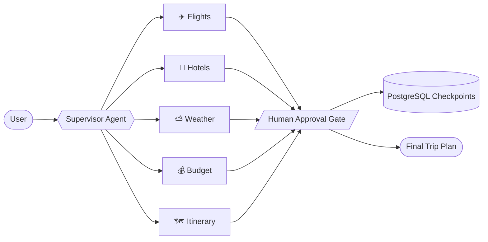

<div align="center">


<a href="https://git.io/typing-svg"></a>

<br/>


<br/>

[](https://www.linkedin.com/in/sai-dash/)
[](mailto:dashsaiprasad831@gmail.com)
[](https://leetcode.com/)


</div>

---

## 👨‍💻 About Me

```js
const sai = {
  role: "Full Stack Developer + GenAI Engineer",
  education: "B.Tech in Computer Science, ITER (SOA), Bhubaneswar · 2026",
  currently: "Developer Intern @ Matrixmonk",
  stack: ["Next.js", "React", "Node.js", "MongoDB", "Python", "LangGraph"],
  strengths: ["RAG pipelines", "Agentic workflows", "MCP tooling", "REST APIs", "DSA"],
  lookingFor: "Fresher SDE / Full-Stack / GenAI roles in India",
};
```

Computer Science graduate (2026) with hands-on internship experience shipping production apps. I also evaluate and validate LLM outputs, test APIs, and build automation across RAG pipelines, agentic workflows and MCP-based tool integrations.

---

## 🏆 Highlights

<table>
<tr>
<td align="center" width="25%"><h3>🥇</h3><b>Smart India Hackathon</b><br/>Winner</td>
<td align="center" width="25%"><h3>🚀</h3><b>Nirman Hackathon</b><br/>Finalist</td>
<td align="center" width="25%"><h3>🧩</h3><b>LeetCode</b><br/>1480+ rating · Top 40% globally</td>
<td align="center" width="25%"><h3>🌐</h3><b>Open Source</b><br/>PR to OpenTelemetry JS</td>
</tr>
</table>

---

## 🛠 Tech Stack

<div align="center">

| | |
| :--- | :--- |
| **Languages** |     |
| **Frontend** |      |
| **Backend & APIs** |     |
| **Databases** |   |
| **GenAI & Agents** |      |
| **LLM APIs** |    |
| **Tools & QA** |       |

</div>

---

## 💼 Experience

### Frontend & Backend Developer Intern · [Matrixmonk](https://www.linkedin.com/in/sai-dash/)
`April 2026 – Present` · Next.js · React · Node.js · Express · MongoDB · LLM APIs · RAG

<details open>
<summary><b>🕉 Sanatan Diksha</b></summary>

- **Gita AI Assistant:** RAG-based assistant over 500+ verses, combining semantic retrieval and LLM generation for source-grounded answers with scripture context.
- **Agentic query pipeline:** intent-driven flow for query classification, context retrieval, LLM reasoning and response validation, cutting irrelevant responses by ~30%.
- **AI integration:** shipped LLM APIs and backend tools into a production Next.js app, powering AI interactions across 15+ screens.

</details>

<details open>
<summary><b>🎓 GlobalFocus</b></summary>

- **University intelligence:** React study-abroad platform with data from 50+ partner universities, where students build profiles and explore target institutions.
- **Student-aware retrieval:** agentic workflow that reads a student's profile and shortlisted universities to retrieve the most relevant information.
- **University news agent:** AI workflow that retrieves and summarises news, admission updates, deadlines and course information for each student's chosen institutions.

</details>

---

## 🚀 Featured Projects

### 🧭 Multi-Agentic AI Travel Planner
`Python` `LangGraph` `MCP` `Groq` `PostgreSQL` `Streamlit`

A supervisor-orchestrated agent system that plans a whole trip end to end.



- LangGraph supervisor coordinating **5+ specialised agents** behind one workflow.
- Custom **FastMCP server** plus third-party MCP servers (weather, flights, web search): **3+ external tools**.
- `interrupt()` approval gates with **PostgreSQL checkpointing** for resumable, human-in-the-loop runs.
- Debugged tool-discovery caching, MCP tool-name mismatches and LLM rate limits, improving workflow completion by **~30%**.

[](https://github.com/SaiprasadDash?tab=repositories)

---

### 🎬 AI Video Assistant
`Python` `RAG` `LangChain` `FastAPI` `React`

Video intelligence and RAG chat for YouTube and local videos.

- Pipeline for transcription, summaries, topic extraction, key points, action items and decision detection.
- Transcript-based **RAG chat** with semantic fragment retrieval for follow-up Q&A grounded in the video.
- **Async FastAPI** job tracking with a React dashboard showing live processing status.
- **pytest** suites covering job creation, status polling and error cases.

[](https://github.com/SaiprasadDash?tab=repositories)

---

### 🔬 Multi-Agent AI Research System
`Python` `LangChain` `Tavily API` `LLMs`

- Specialised agents for web research, content extraction, report drafting and review.
- Live retrieval through **Tavily**, feeding sources into an LLM synthesis pipeline.
- Automated **critique stage** that checks reports for correctness and consistency before the final answer.

[](https://github.com/SaiprasadDash?tab=repositories)

---

### 🏔 PeakPrep: AI-Powered HR Feedback Platform
`MERN` `Flask` `LaTeX` `Gemini API`

- Full-stack interview-prep platform on Node.js, Express, MongoDB, React and Flask.
- **Gemini API** for resume suggestions, chatbot responses and interview feedback.
- **LaTeX resume builder** that produces ATS-friendly PDFs from structured user data.

[](https://github.com/SaiprasadDash?tab=repositories)

---

## 🌐 Open-Source

| Project | Contribution |
| :--- | :--- |
| [**open-telemetry/opentelemetry-js**](https://github.com/open-telemetry/opentelemetry-js/pull/6995) | PR #6995: wildcard attributes processor |

---

## 🎓 Education

**B.Tech in Computer Science**, Siksha 'O' Anusandhan (ITER), Bhubaneswar · 2022 – 2026
Coursework: Data Structures & Algorithms · OOP · DBMS · Operating Systems · Computer Networks

---

## 📊 GitHub Stats

<div align="center">


</div>

---

## 📫 Let's Connect

I'm looking for **fresher SDE, full-stack and GenAI roles**. If you're hiring or want to build something together, I'd love to hear from you.

<div align="center">

[](https://www.linkedin.com/in/sai-dash/)
[](mailto:dashsaiprasad831@gmail.com)


</div>